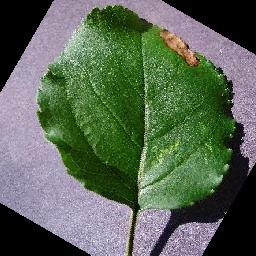
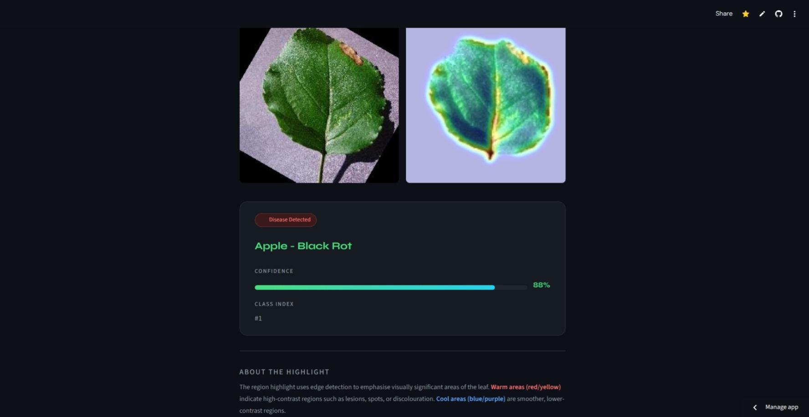
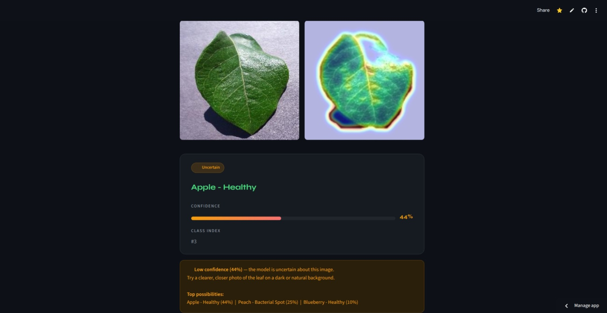

# 🌿 Plant Disease Detection

> AI-powered plant disease classifier using CNN + Grad-CAM visualization

🔗 **Live Demo:** https://plantdiseasedetection-appy.streamlit.app/

---

## 📸 Project Screenshots

| Upload & Predict | Region Highlight & Result |
|------------------|-----------------|
|  | |
|  |  |

---

## 🧠 About

This app detects plant diseases from leaf images using a Convolutional Neural Network trained on the PlantVillage dataset. It classifies **38 disease/healthy classes** across 14 crops and visualizes model decisions using **Grad-CAM heatmaps**.

---

## 🌱 Supported Crops & Diseases

| Crop | Conditions |
|------|-----------|
| Apple | Apple Scab, Black Rot, Cedar Apple Rust, Healthy |
| Blueberry | Healthy |
| Cherry | Powdery Mildew, Healthy |
| Corn | Cercospora Leaf Spot, Common Rust, Northern Leaf Blight, Healthy |
| Grape | Black Rot, Esca, Leaf Blight, Healthy |
| Orange | Haunglongbing (Citrus Greening) |
| Peach | Bacterial Spot, Healthy |
| Pepper Bell | Bacterial Spot, Healthy |
| Potato | Early Blight, Late Blight, Healthy |
| Raspberry | Healthy |
| Soybean | Healthy |
| Squash | Powdery Mildew |
| Strawberry | Leaf Scorch, Healthy |
| Tomato | Bacterial Spot, Early Blight, Late Blight, Leaf Mold, Septoria Leaf Spot, Spider Mites, Target Spot, Yellow Leaf Curl Virus, Mosaic Virus, Healthy |

---

## ⚙️ Model Architecture

- **Type:** Small Custom CNN
- **Input:** 128×128 RGB images
- **Layers:** 3× Conv2D + BatchNorm + MaxPooling → Dense(256) → Dropout → Softmax
- **Classes:** 38
- **Validation Accuracy:** ~89%
- **Training Dataset:** 70,295 images | Validation: 17,572 images

---

## 🔍 How Grad-CAM Works

Grad-CAM (Gradient-weighted Class Activation Mapping) highlights the regions of the image the model focused on to make its prediction.

- 🔴 **Warm colors (red/yellow)** — high activation, features that influenced the prediction
- 🔵 **Cool colors (blue/purple)** — low activation, regions largely ignored

---

## 📁 Project Structure

```
├── plant_app.py               # Streamlit app
├── plant_model_quant.tflite   # Quantized TFLite model (~6.5MB)
├── requirements.txt           # Dependencies
├── project_imgs/              # Screenshots
└── README.md
```

---

## 🛠️ Tech Stack


---

## 👥 Team

- Fatima Mustafa
- Juveria Ikram
- Saadia Yaseen
- Tasneem Begum

---
