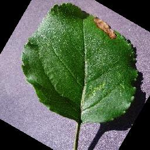
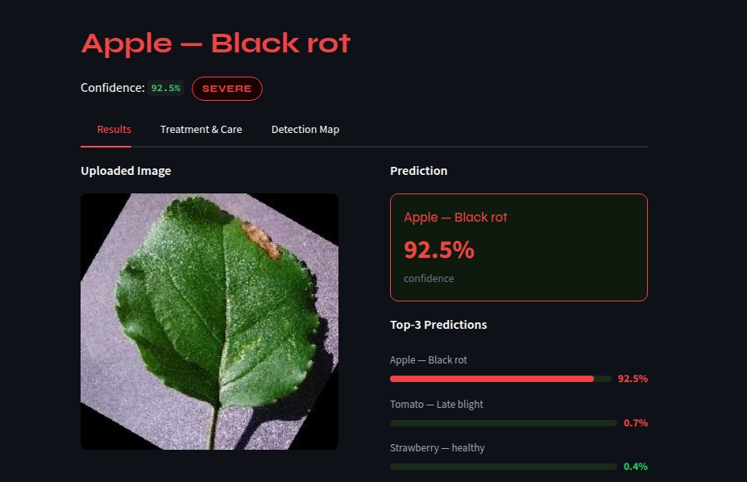
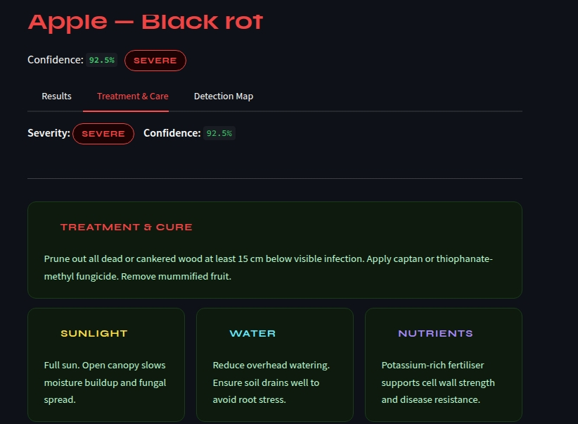
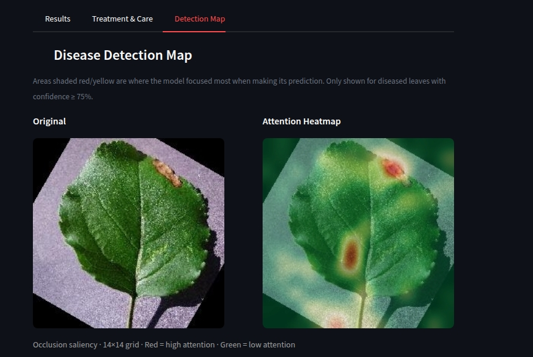
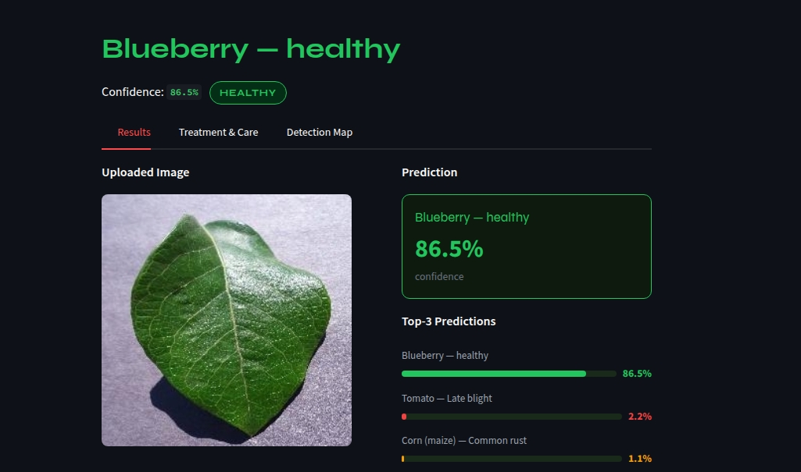
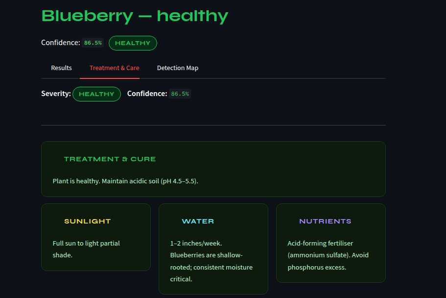
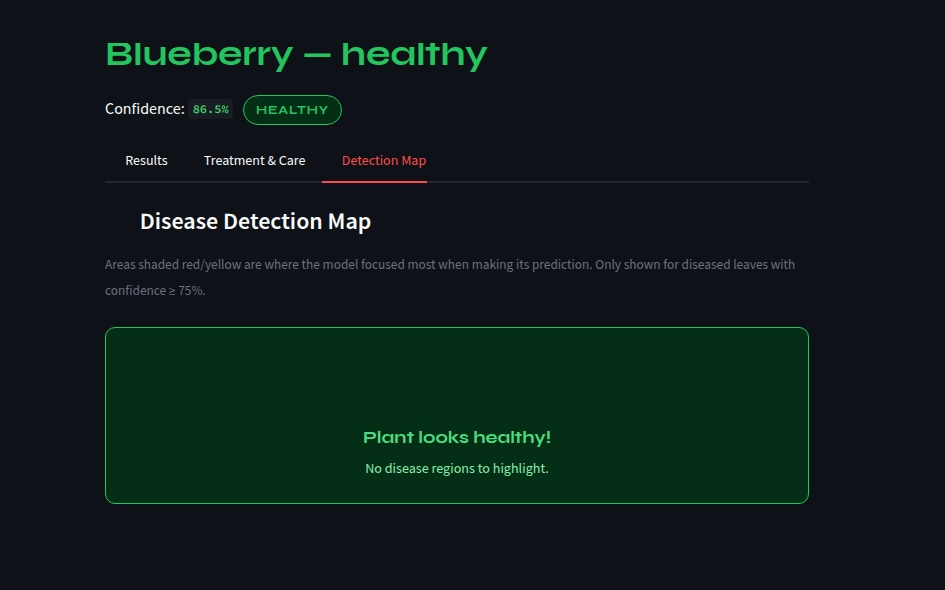

# 🌿 Plant Disease Detection

> AI-powered plant disease classifier using EfficientNetB3 transfer learning + occlusion saliency heatmap

🔗 **Live Demo:** https://plantdiseasedetection-appy.streamlit.app/

---

## 📸 Project Screenshots

| Upload & Predict | Region Highlight & Result |
|------------------|-----------------|
|  |    | 
|  |      |

---

## 🧠 About

This app detects plant diseases from leaf photographs using **EfficientNetB3**, a state-of-the-art convolutional neural network pretrained on ImageNet and fine-tuned on the PlantVillage dataset. It classifies **38 disease and healthy categories** across **14 crop types**.

Key feature: the app doesn't just predict — it also **rejects unrecognised images**. If you upload a random photo that doesn't look like a known plant leaf, it says so instead of confidently giving a wrong answer. For confirmed disease predictions, it shows an **attention heatmap** that highlights which parts of the leaf influenced the model's decision, along with **treatment and care advice** specific to the detected disease.

---

## 🌱 Supported Crops & Diseases

| Crop | Conditions |
|------|------------|
| Apple | Apple Scab, Black Rot, Cedar Apple Rust, Healthy |
| Blueberry | Healthy |
| Cherry | Powdery Mildew, Healthy |
| Corn | Cercospora Leaf Spot, Common Rust, Northern Leaf Blight, Healthy |
| Grape | Black Rot, Esca (Black Measles), Leaf Blight, Healthy |
| Orange | Haunglongbing (Citrus Greening) |
| Peach | Bacterial Spot, Healthy |
| Bell Pepper | Bacterial Spot, Healthy |
| Potato | Early Blight, Late Blight, Healthy |
| Raspberry | Healthy |
| Soybean | Healthy |
| Squash | Powdery Mildew |
| Strawberry | Leaf Scorch, Healthy |
| Tomato | Bacterial Spot, Early Blight, Late Blight, Leaf Mold, Septoria Leaf Spot, Spider Mites, Target Spot, Yellow Leaf Curl Virus, Mosaic Virus, Healthy |

---

## ⚙️ Model Architecture

- **Base model:** EfficientNetB3 (pretrained on ImageNet)
- **Input size:** 224 × 224 RGB images
- **Training strategy:** Two-phase transfer learning
  - Phase 1 — base frozen, train classification head only (10 epochs, LR 1e-3)
  - Phase 2 — top 80 layers unfrozen, fine-tune (up to 25 epochs, LR 5e-5)
- **Classification head:** GlobalAvgPooling → BatchNorm → Dropout(0.4) → Dense(256, ReLU, L2) → Dropout(0.3) → Dense(38, Softmax)
- **Loss:** CategoricalCrossentropy with label smoothing 0.1
- **Classes:** 38
- **Validation accuracy:** ~93–96%
- **Dataset:** PlantVillage — ~87,000 images (80% train / 20% val)
- **Deployment model:** TFLite float16 quantized (~20 MB)

---

## 🛡️ OOD Rejection

Most plant disease models will classify *any* image into one of the 38 classes, even a photo of a wall or a hand. This app has two rejection checks that run before every prediction:

1. **Confidence gate** — if the top predicted class has confidence below 55%, the image is rejected
2. **Entropy gate** — if the spread of probabilities across all 38 classes is too uniform (normalised Shannon entropy > 65% of the theoretical maximum), the image is rejected

If either check fails, a rejection card is shown instead of a wrong prediction.

---

## 🔬 Detection Map

For disease predictions above 75% confidence, the app generates an **occlusion saliency heatmap**:

- The image is divided into a 14×14 grid
- Each patch is temporarily blacked out and the model is re-run
- Patches whose removal causes the biggest confidence drop are the most important
- The result is rendered as a smooth colour overlay — **red = high model attention, green = low attention**
- No bounding boxes — they were removed because boxes drawn from saliency maps highlight statistically important regions, not the actual physical location of disease lesions, which is misleading

---

## 📁 Project Structure

```
├── plant_app.py               # Streamlit app
├── disease_info.py            # Treatment & Care
├── plant_model_quant.tflite   # Quantized TFLite model
├── requirements.txt           # Dependencies
├── project_imgs/              # Screenshots
└── README.md
```

---


| Component | Technology |
|-----------|-----------|
| Model | EfficientNetB3 (Keras, ImageNet pretrained) |
| Deployment model | TensorFlow Lite float16 |
| Web app | Streamlit 1.45.0 |
| Background removal | OpenCV GrabCut |
| Heatmap | Occlusion saliency + Matplotlib RdYlGn_r |
| Training platform | Kaggle Notebook |
| Hosting | Streamlit Community Cloud |

---

## 👥 Team

| Name | Role |
|------|------|
| Fatima Mustafa H | Team Lead |
| Juveria Ikram | Member |
| Saadia Yaseen | Member |
| Tasneem Begum | Member |

**Guide:** Ms. Mayuri Khaparde<br/>
**Programme:** AICW Engineer Spoke · Edunet Foundation × Microsoft · SWCET
